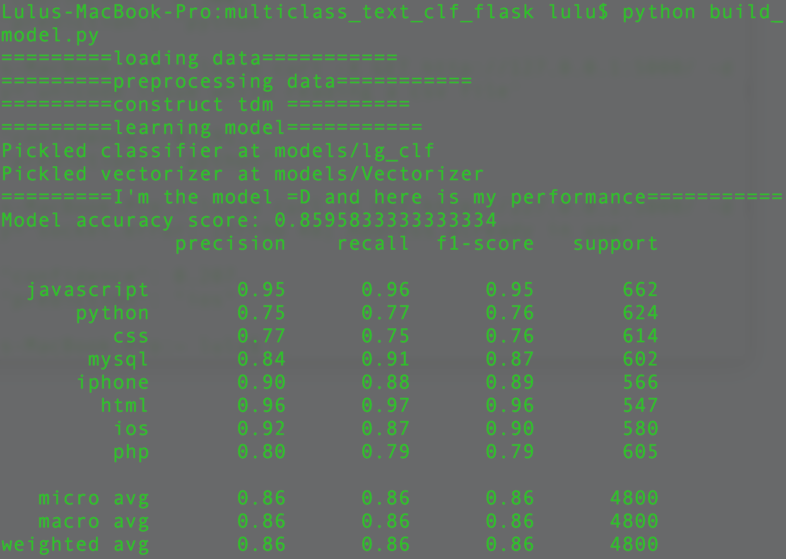
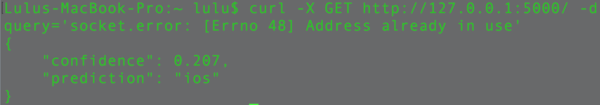

# Multiclass-TextClassificaton-with-Flask
A simple REST API (with Flask) for multi-class text classification.

## Introduction

### Purpose
The purpose of this project is to build a multi-class text classifier that classifies new text inputs into the following categories: javascript, python, css, mysql, iphone, html, ios, php.

### Dataset
Stack Overflow questions and tags is used in this project. This dataset is available in Google BigQuery also a public Cloud Storage [URL](https://storage.googleapis.com/tensorflow-workshop-examples/stack-overflow-data.csv). It is chosen since the classes are well balanced. There are 20 classes of the questions asked, but instead of using the whole dataset, a subset consisting of 8 classes are selected. They are questions about javascript, python, css, mysql, iphone, html, ios, and php.

### File Notes
* app.py: Flask API application
* model.py: class object for Logistic Regression model
* build_model.py: model construction
* requirements.txt: list of packages that the app will import  


## Test the API

### Requirements
* Python 2.7
* Flask
* Packages listed in requirements.txt

### Test Locally
1. Download the files

2. Train the classifier
```
$ python build_model.py
```
Sample output in the terminal


3. Start the Flask API
```
python app.py
```

4. Start a new terminal
5. Use curl to make a GET request at the URL of the API.
```
$ curl -X GET http://127.0.0.1:5000/ -d query='socket.error: [Errno 48] Address already in use'
```
Sample output in the terminal

